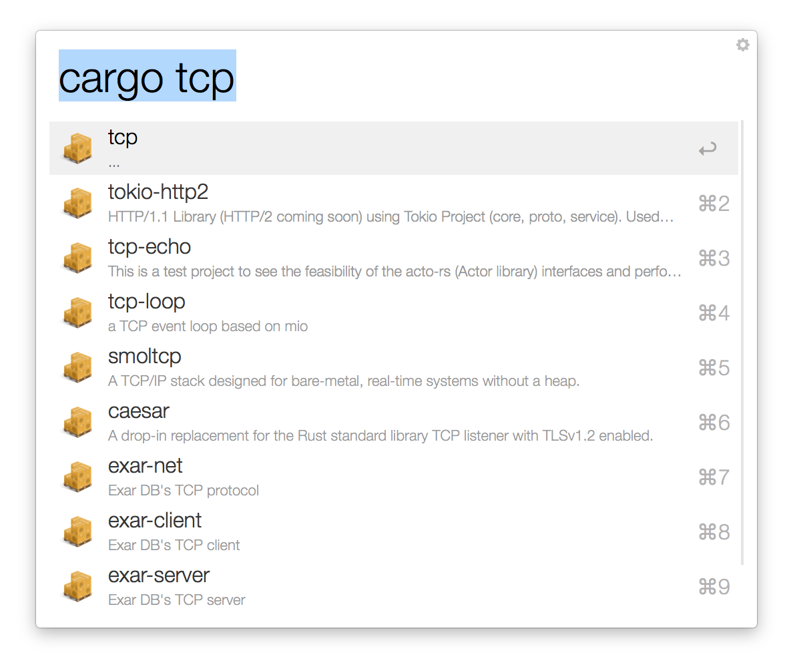

Workflow for searching Rust crates from Alfred.

<p align="center"></p>

## Commands

* `cargo {query}`: search for Rust crates

## Setup

```
cargo build --release
```

## Additional Notes

This workflow require constant internet connection.

It can break from time to time due to changes by the provider of the repo. If you notice a workflow stops working, post it at https://github.com/fgribreau/alfred-crates/issues.
